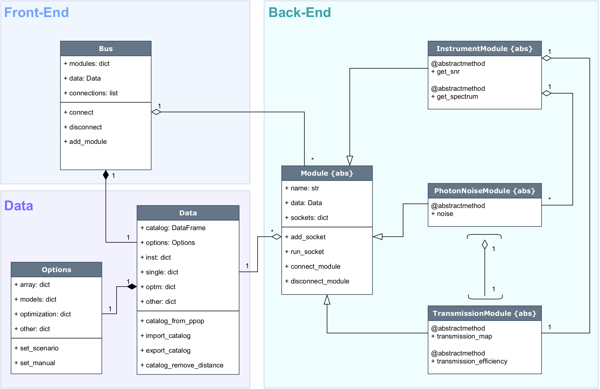
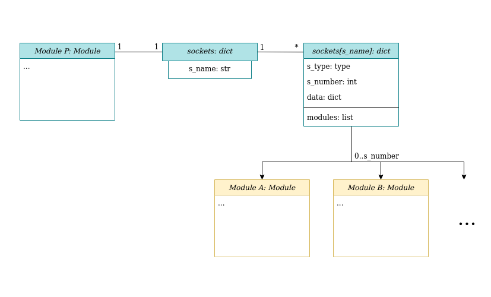
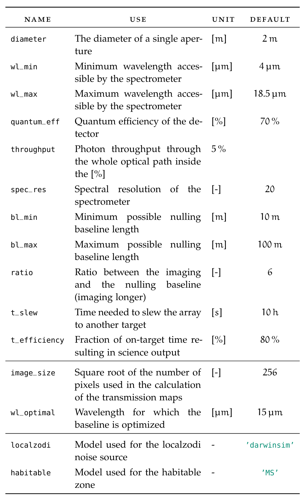
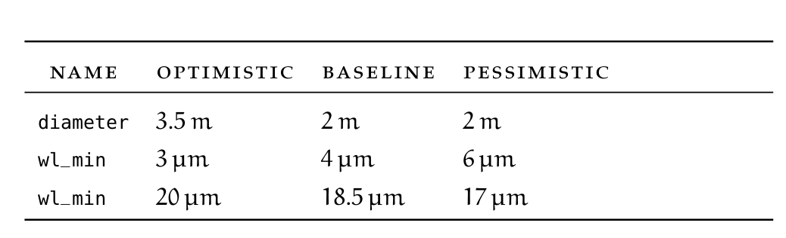
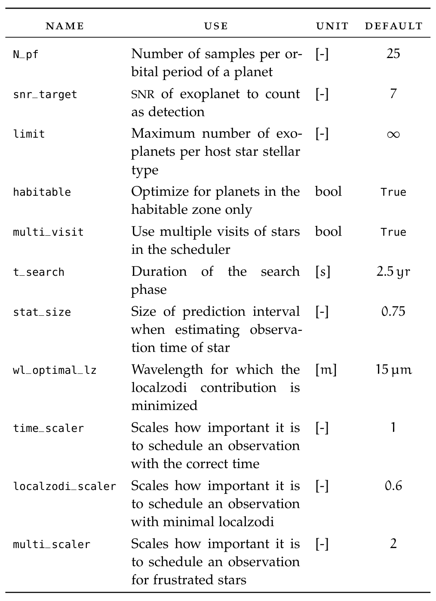

Architecture
============

Introduction
------------
This section is meant to function as a starting point for anyone interested in contributing to
LIFEsim or understanding the underlying programming ideas behind the package. First, the core of
the package is described in some detail. This is then followed up by an example on how to program
a new LIFEsim module.

General Structure
-----------------

Apart from the functional goals, the core of LIFEsim is programmed to achieve two major goals:

    1. LIFEsim must be easy to use for users unfamiliar with programming and for programmers
       unfamiliar with the code
    2. LIFEsim must be easy to extend.

The implicit aim of goal (1.) is that all members of the LIFE team, largely independent from their
background and level of knowledge, should be able to run a LIFEsim simulation. The implicit aim of
goal (2.) is that a student can contribute to LIFEsim in the scope of an ETH semester project.

The diagram above outlines the general core architecture of LIFEsim.

The Bus
-------
The Bus class is the main interface between the user and a LIFEsim simulation. Hence, it is
considered to be part of the LIFEsim front-end. All modules taking part in the simulation are
aggregated by the Bus. Via the Bus, the user is able to connect modules via their sockets.
Furthermore, the Bus holds a single Data class by composition and forwards it to any modules
connected to the bus. This makes sure that there are no conflicting instances of the Data class in
a single simulation.

Modules
-------

The underlying idea behind the Module class is that every physical, (partially) self-contained
model is written into its own Module. This simplifies the program layout and makes it easier to
understand on an abstract level.
If a new physical model is to be added to LIFEsim, the programmer should create an abstract class
inheriting from the Module class. Then, the programmer should identify all functions that the new
module should fulfill. These functions are implemented as a stub abstract method, forcing any
inheriting modules to implement the respective functionalities. Note here, that on this level the
modules should not contain any functional code, but are rather filled with placeholder pass
statements.

The Data Class
--------------

All data, parameters and options for LIFEsim are contained in the Data and Options classes.
Located in the Data class is a catalog containing all target stars and exoplanets and additionally
allocated space to save variables needed in the respectively used modules. The catalog can be
directly imported from P-Pop.

The Options class saves parameters in dictionaries split after which part of the simulations the
parameters concern. The parameters can be set according to existing baseline, optimistic and
pessimistic scenarios for a future realization of the LIFE mission. A list of all options and the
scenarios can be found in the tables at the bottom of the page. The Options class is connected
to the Data class by composition, making sure that only a single instance of options can exist in
any given simulation.

Sockets
-------
The method of using sockets is implemented as a tool for interface management between the
modules. This allows for independent implementation and re-implementation of modules. The
the following is a description of the sockets functionality and how they should be used.

Each `Module` has an attributed dictionary called `sockets`. The elements of this dictionary is
accessed by a string key, which doubles as the name of the socket. If `Module P` (see picture
below) is to be connected to `Module A`, the following set-up needs to be done.

An entry in the `sockets` dictionary under a unique socket name ``s_name`` is created (e.g.
``s_name = 'connection_a'``). This element contains itself another dictionary specifying

    - the type of module the socket should accept.
    - the number of modules that can be connected to this socket.
    - a (currently empty) list tracking which modules are connected to the socket.

The set-up of the socket is now complete. Connecting the socket is done via the bus as follows

.. code-block:: python
    :linenos:

    bus = lifesim.Bus()

    mod_p = lifesim.Module_P(name='module_p')
    bus.add_module(mod_p)

    mod_a = lifesim.Module_A(name='module_a')
    bus.add_module(mod_a)

    bus.connect(('module_p', 'module_a'))

The command in Line 9 searches all sockets of the instance of Module P if they accept connection
from an instance of Module A, and connects them if suitable socket is found. The same is done
vice-versa, meaning that all Module A sockets are search for connections to Module P.

Now, ``module_a`` is connected to the socket ``connection_a`` of ``module_p``. It can therefore be
accessed in ``module_p`` by calling ``self.sockets['connection_a']['modules'][0]``.

List of Parameters
------------------

