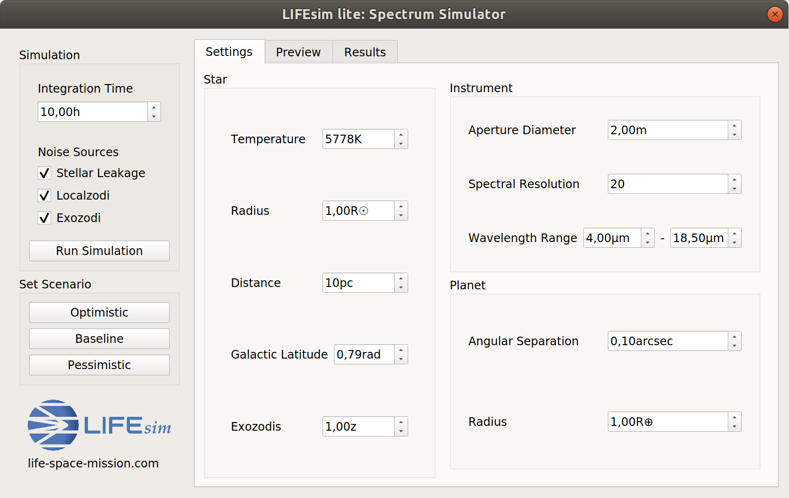
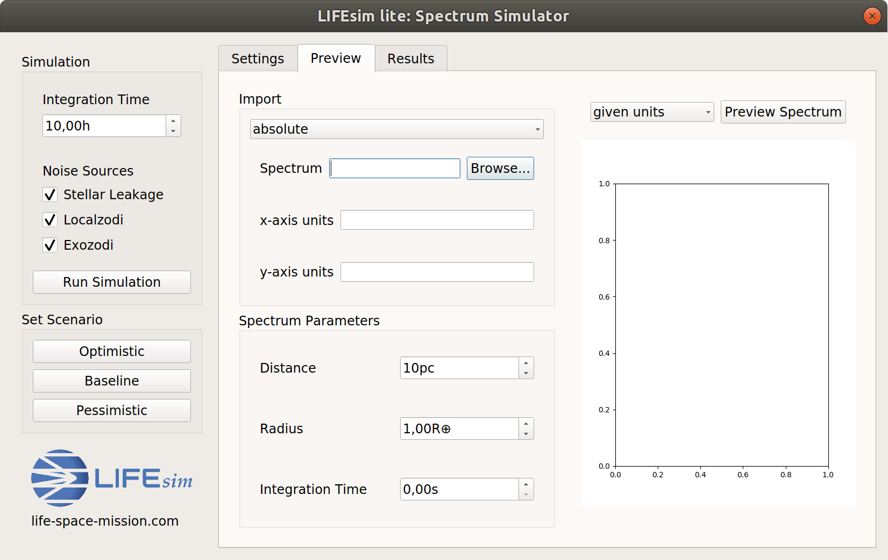
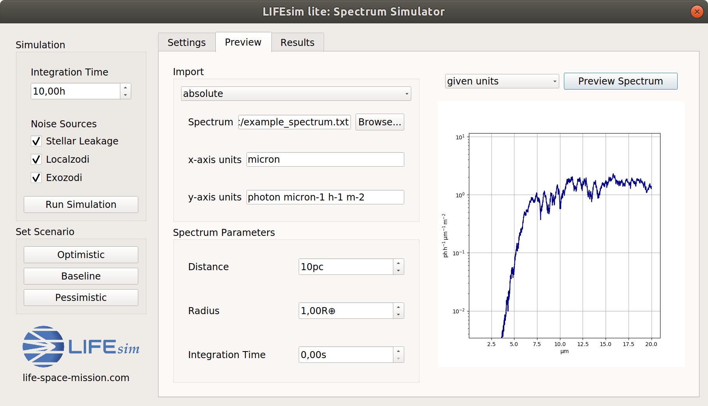
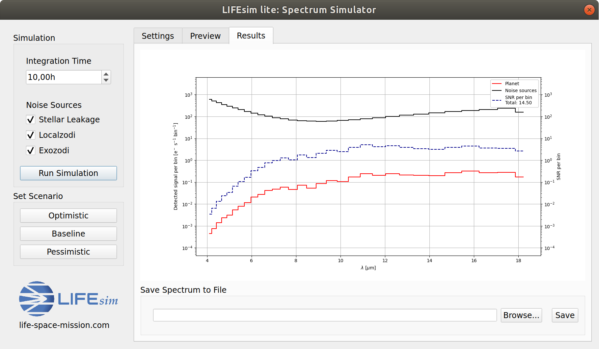

First Examples
==============

The following examples will explore the current two main functionalities of LIFEsim: The simulation
of single exoplanets with a given spectrum and the simulation of the LIFE search phase on a catalog
of a simulated exoplanets populated.

Using the GUI
-------------

The following is a minimal working example of simulating a spectral observation of an exoplanet
with the LIFEsim GUI.

As a first step, activate the virtual environment containing the LIFEsim install with

.. code-block:: console

   $ source path_to_new_folder/new_folder/bin/activate

Open python

.. code-block:: console

   $ python

Then, open the LIFEsim spectrum simulator GUI by running

.. code-block:: python

   >>> from lifesim import Gui
   >>> Gui()

With executing this command, the following GUI will open

Notice the three tabs for setting the instrument options, importing and previewing the spectrum and
displaying the results.
In the *Settings* tab, the required parameters for the target star and planet can be set manually.
The parameters for the instrument can either be set manually or by pressing on a scenario button on
the left side (e.g. *Optimistic*). This then automatically sets the instruments parameters to
correspond with what the LIFE team currently views as an optimistic, baseline or pessimistic
scenario.

For importing a spectrum, navigate to the *Preview* tab.

Begin by choosing a spectrum to import (in .txt format) by clicking on *Browse...*. To complete
this example, please download |ThisFile| and open it in
the pop-up dialog. Leave the option as *absolute* to only use the imported spectrum. Setting the
option to *additive* will add the imported spectrum to the planets black body spectrum calculated
according to given parameters.

.. Hint::

   A pure black body planet can be simulated by choosing the *additive* option and leaving the
   file dialog empty.

   .. image:: _static/GUI_example_blackbody.png
      :width: 70%
      :align: center

To specify the units of the spectrum you are importing, enter them in the fields *x-axis units* and
*y-axis units*. For this example, please set *x-axis units* to ``micron`` and *y-axis units* to
``photon micron-1 s-1 m-2``.

In the *Spectrum Parameter* field the parameters used during the creation of the spectrum need to
be given. Again, for the example please set *Distance* to ``10pc``, *Planet Radius* to ``1 Earth
Radius`` and leave *Integration Time* at 0.

Pressing *Preview Spectrum* will now show the spectrum in the units specified by the user. This can
be used to check the correct import of the spectrum.

Changing the drop-down menu to *converted units* will show the spectrum in the units used in
LIFEsim. This completes setting up the simulator for a run.

Change to the *Results* tab and press *Run Simulation* on the very left. This will run the
simulation and the display the results as shown below.

Above the *Run Simulation* button you can change the *Integration Time* of the simulation and
select or deselect the inclusion of specific noise sources in the simulation.

At the bottom of the *Results* tab you can choose a location to save the results at by clicking on
*Browse...* and then save the results by clicking *Save*.

Simulating the Search Phase
---------------------------

LIFEsim is capable of taking an artificial exoplanet catalog input from |p-pop|, calculate the
signal-to-noise ratio for each planet and distribute the observation time available in the search
phase to observe and detect an optimal number of exoplanets.

.. Hint::

    The following example mirrors the file ``LIFEsim/lifesim_demo.py``.

Set-Up
~~~~~~

To run such a simulation, create a new python file. First, LIFEsim needs to imported

.. code-block:: python
    :lineno-start: 1

    import lifesim

LIFEsim is programmed such that all data and parameters are saved in a single location, which then
distributes those to the relevant modules. Create an instance of this so-called ``bus``

.. code-block:: python
    :lineno-start: 6

    bus = lifesim.Bus()

The bus holds all parameters needed for the simulation (e.g. the collector aperture diameter, the
duration of the search phase, etc.). They can all be set at the same time by using scenarios
predefined by the LIFE team. These scenarios are the 'baseline' case, where the array configuration
is as expected, as well as the 'optimistic' and 'pessimistic' case, where the array is set up in a
more or less capable way. Set the parameters to the baseline case by running

.. code-block:: python
    :lineno-start: 9

    bus.data.options.set_scenario('baseline')

Note, that options can also be set manually. For example, the collector aperture diameter can be
manually increased to four meters by

.. code-block:: python
    :lineno-start: 12

    bus.data.options.set_manual(diameter=4.)

A list of all available options and parameters can be found in the API Documentation for
`lifesim.util.options`.

Loading the Catalog
~~~~~~~~~~~~~~~~~~~

Now, the P-Pop catalog can be loaded in. An example catalog can be found in
``LIFEsim/docs/_static``. Run

.. code-block:: python
    :lineno-start: 16

    bus.data.catalog_from_ppop(input_path='path_to_LIFEsim/LIFEsim/docs/_static/baselineSample.fits')

.. Important::

    The given P-Pop catalog populates known stars in the solar neighborhood of up to 20 pc with
    artificial planets based on the Kepler statistics. This population is done not only once, but
    in a Monte Carlo approach 500 different universes are simulated. This needs to be kept in mind
    when the results are interpreted.

With the catalog loaded into LIFEsim, some selections of stars can be removed. The following will
remove all A-type stars and every M-type at a distance larger than 10 pc away from earth.

.. code-block:: python
    :lineno-start: 17

    bus.data.catalog_remove_distance(stype=0, mode='larger', dist=0.)
    bus.data.catalog_remove_distance(stype=4, mode='larger', dist=10.)

.. Hint::

    LIFEsim uses the following numeric integer keys for stellar types:

    0 = A, 1 = F, 2 = G, 3 = K, 4 = M.

With this, the setup for the simulation is complete.

Creating the Instrument
~~~~~~~~~~~~~~~~~~~~~~~

Now, an instance of the LIFEsim instrument module needs to be created.

.. code-block:: python
    :lineno-start: 24

    instrument = lifesim.Instrument(name='inst')

To give any module access to the data and parameters used in a simulation, it needs to be connected
to the bus.

.. code-block:: python
    :lineno-start: 25

    bus.add_module(instrument)

Next, all modules needed for the instrument module to run need to be created. A list of the
required modules can be found in the API Documentation of `lifesim.instrument.instrument`. First,
create the module responsible for simulating transmission maps of a four-arm nulling
interferometer and add it to the bus.

.. code-block:: python
    :lineno-start: 27

    transm = lifesim.TransmissionMap(name='transm')
    bus.add_module(transm)

Next, create the modules for the simulation of the astrophysical noise sources and add them to the
bus.

.. code-block:: python
    :lineno-start: 30

    exozodi = lifesim.PhotonNoiseExozodi(name='exo')
    bus.add_module(exozodi)
    localzodi = lifesim.PhotonNoiseLocalzodi(name='local')
    bus.add_module(localzodi)
    star_leak = lifesim.PhotonNoiseStar(name='star')
    bus.add_module(star_leak)

Now, the instrument needs to be told to which modules it should connect to. Do so by running

.. code-block:: python
    :lineno-start: 38

    bus.connect(('inst', 'transm'))
    bus.connect(('inst', 'exo'))
    bus.connect(('inst', 'local'))
    bus.connect(('inst', 'star'))

    bus.connect(('star', 'transm'))

Note, that not all noise sources need to be connected in order for the instrument simulation to
run. If required, individual noise sources can be disconnected by running

.. code-block:: python

    >>> bus.disconnect(('inst', 'exo'))

Creating the Optimizer
~~~~~~~~~~~~~~~~~~~~~~

The optimizer is responsible for distributing the available observing time onto the individual
stars. Analogously to above, run

.. code-block:: python
    :lineno-start: 50

    opt = lifesim.Optimizer(name='opt')
    bus.add_module(opt)
    ahgs = lifesim.AhgsModule(name='ahgs')
    bus.add_module(ahgs)

    bus.connect(('transm', 'opt'))
    bus.connect(('inst', 'opt'))
    bus.connect(('opt', 'ahgs'))

Running the Simulation
~~~~~~~~~~~~~~~~~~~~~~

First, the signal-to-noise ratio needs to be calculated for every planet in the catalog. To do so,
run

.. code-block:: python
    :lineno-start: 64

    instrument.get_snr()

This function will assign every planet the SNR after one hour of observation. Since the simulation
is entirely contained in the radom noise case, the SNR scales with square-root of the integration
time. Therefore, the SNR for any integration time can be calculated by knowing the SNR of a
specific integration time.

.. Note::

    It is not unusual for ``instrument.get_snr()`` to take up to an hour to complete.

Knowing the SNR for each planet, the integration time can be optimally distributed by

.. code-block:: python
    :lineno-start: 66

    opt.ahgs()

In the baseline case, the observation time is distributed such that the number of planets in the
habitable zone around their respective host stars is optimized. The optimization can be changed to
respect all planets by setting

.. code-block:: python

    >>> bus.data.options.optimization['habitable'] = True

Check the API Documentation for `lifesim.util.options` to see all parameters used in the
optimization process.

Saving the Results
~~~~~~~~~~~~~~~~~~

After a simulation run, the results can be saved as a hdf5 file for later analysis by using

.. code-block:: python
    :lineno-start: 70

    bus.data.export_catalog(output_path='path/filename.hdf5')

Reading the Results
~~~~~~~~~~~~~~~~~~~

A previously saved simulation can be read into LIFEsim by running

.. code-block:: python
    :lineno-start: 75

    bus_read = lifesim.Bus()
    bus_read.data.options.set_scenario('baseline')
    bus_read.data.import_catalog(input_path='path/filename.hdf5')

Interpreting Results
~~~~~~~~~~~~~~~~~~~~

All results are saved in the catalog located at ``bus.data.catalog``. This pandas data frame
contains rows representing the individual artificial exoplanets. The meaning of most columns can be
found in the file ``LIFEsim/lifesim/core/data.py``. The most important columns are listed in the
following:

    - ``'nuniverse'`` : The index for the universe the planet is located in. See 'Important' box
      above for further explanation.
    - ``'nstar'`` : The unique index for the star.
    - ``'habitable'`` : Is ``True`` if the planet resides in the habitable zone of its host star.
    - ``'snr_1h'`` : The signal-to-noise ration the planet would have after one hour of integration
      time.
    - ``'detected'``: Is ``True`` if the planet is observed long enough to have an SNR larger than
      bus.data.option.optimization['snr_target']. In this case, the planet is counted towards
      the planets detected in the search phase.
    - ``'int_time'``: The amount of integration time spend on the system in [s].

Interpretation of this catalog is easily facilitated by the usage of selection masks. For example,
the number of detected exoplanets in the habitable zone around M-type stars would be retrieved via

.. code-block:: python

    >>> import numpy as np
    >>> mask_mtype = bus.data.catalog.stype == 4
    >>> mask = np.logical_and.reduce((bus.data.catalog.detected, bus.data.catalog.habitable, mask_mtype))
    >>> result_number = mask.sum()/500

Note the division by 500 to factor out the 500 simulated universes.

.. |p-pop| raw:: html

   <a href="https://github.com/kammerje/P-pop" target="_blank">P-Pop</a>

.. |ThisFile| raw:: html

   <a href="https://raw.githubusercontent.com/fdannert/LIFEsim/master/docs/_static/example_spectrum.txt" target="_blank">this file from the LIFEsim GitHub</a>
