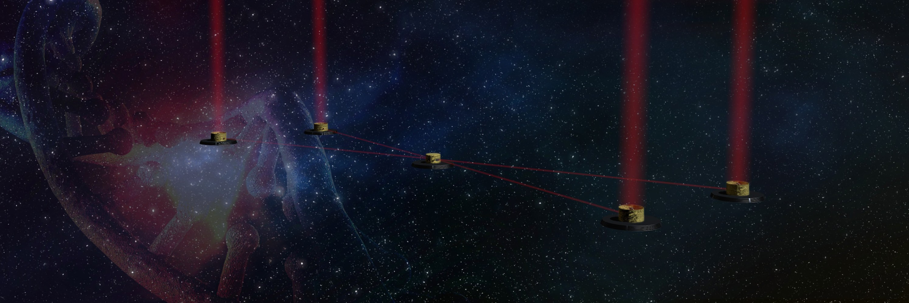

Welcome to LIFEsim's documentation!
===================================

LIFEsim is the simulator software for the Large Interferometer For Exoplanets (LIFE). It simulates
the interferometric measurement of LIFE to demonstrate the capabilities of the observatory. Coupled
with on-sky source simulations, LIFEsim will infer the amount and diversity of exoplanets
observable with LIFE. Inputting spectral information of exoplanets allows for a description of the
spectral measurement potential of LIFE.

For more information, please visit the |LIFE Website|.

.. toctree::
   :maxdepth: 4
   :caption: Getting Started

   installation
   windows
   example

.. toctree::
   :maxdepth: 4
   :caption: Contributing

   architecture
   contributing

.. toctree::
   :maxdepth: 3
   :caption: API Documentation

   core
   instrument
   util

.. |LIFE Website| raw:: html

   <a href="https://www.life-space-mission.com/" target="_blank">LIFE Website</a>
